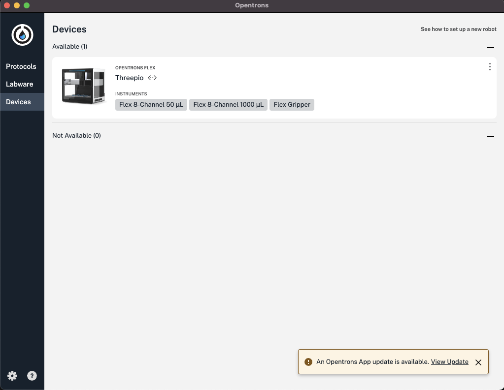
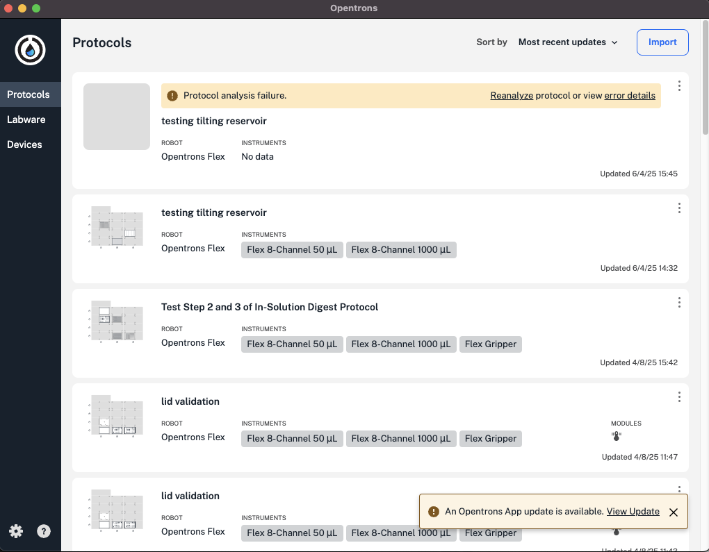

# opentrons app

The opentrons app is the primary interface for sending protocols to the robot to be run.

## Usage

It is important to be connected to the same WiFi network that the robot is connected to. In our case, we need to be connected to LUC. 

For some reason, this may not work the first time, so you may need to plug your laptop into the robot through ethernet for the app to recognize the robot for the first time. 

Threepio should show up in your devices tab. 

The protocols tab allows you to upload your protocols to be run by the robot. 

You can click import and upload the python file directly to the protocols tab. 

The labware tab is where you can upload custom labware definitions for more advanced usage. This is beyond the scope of this tutorial. 

