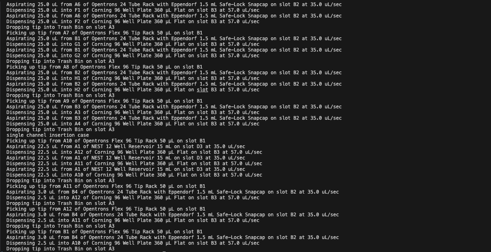
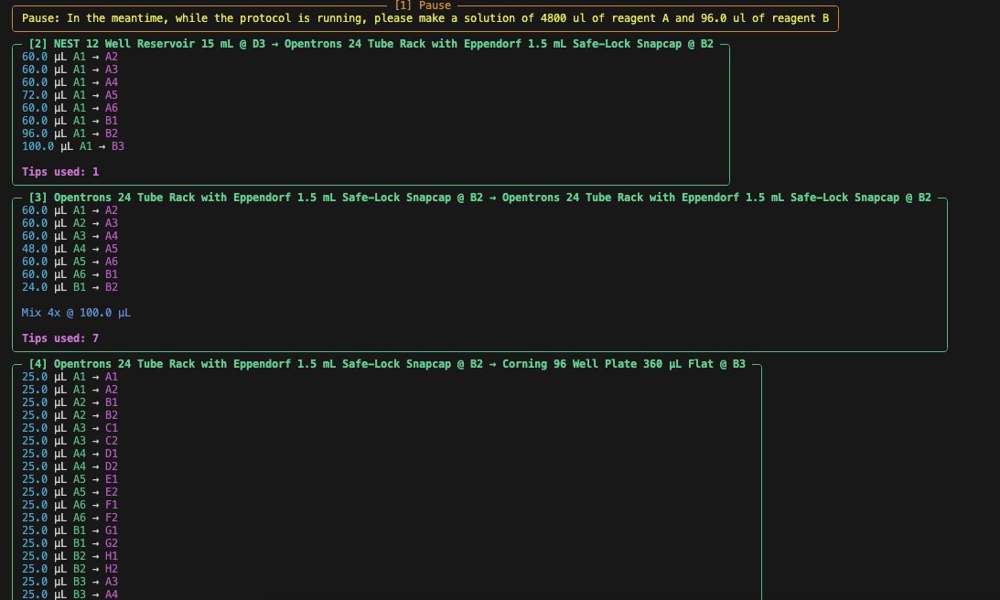

# simulate
The opentrons package allows protocols to be simulated in order to check for accuracy before running a physical experiment. 

## Usage

As a preface, in a previous version of the opentrons package, simulate was bugged and did not work after installing opentrons. You may have to run this command to manually install simulate in your environment. 

```bash
pip install --no-cache-dir --force-reinstall opentrons-hardware@git+https://github.com/Opentrons/opentrons@release#subdirectory=hardware
```


An example of simulating a protocol can be seen in the simulate_protocol.py script in the examples folder. 

```bash
from opentrons.simulate import simulate, format_runlog

protocol_file = open("./Protocols/your_script_here.py")

runlog, _bundle = simulate(protocol_file,
                           custom_labware_paths=["../RobotProtocols"] )

print(format_runlog(runlog)) 
```

The runlog contains a step by step output of all the actions the robot performs during the duration of the protocol. 



I find that this is difficult to read and often induces a headache after a couple of hours of writing protocols, so I wrote a wrapper module that formats it in a nicer way. It is available in the prettify-simulate repository in the JKirkLab organization. 

The output of the prettify-simulate module looks like the following: 



You can read more specifics about the prettify-simulate module in its README file. 


