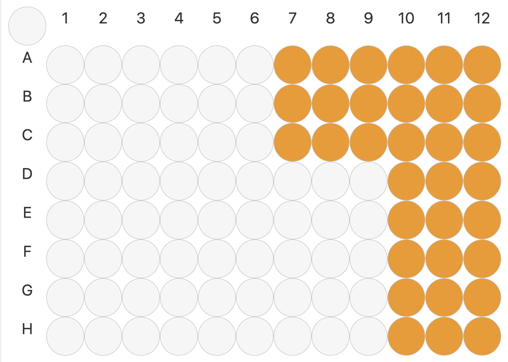

# Tips and Tricks

Sometimes you may need to implement custom solutions for problems that cannot be solved by native opentrons labware. Perhaps you might have to implement a solution that the native aspirate, dispense, mix functions cannot handle.  This is a short document containing a few of the solutions and optimizations we've come across.
# Deletion Trick

The opentrons API does not inherently support stacking labware, meaning two pieces of labware cannot occupy the same slot. This is problematic for lids and other labware that is meant to be stacked. The work around for this is by managing the state of the deck by deleting and reloading labware when two different labware need to be stacked. For example, if you had a lid and an eppendorf rack, you would delete the eppendorf rack from the deck before moving the lid to that slot. In addition, you would need to account for the drop offset since the robot believes that nothing is occupying the deck slot, while physically the rack is still present. 

For example in our In Solution Digestion protocol:
```python
lid.move_lid(protocol, "B3", labware) 
```

A custom lid class was made such that a lid can be placed on top of an eppendorf rack. 

```python
class Lid: 
    def __init__(self,location, under, labware_obj, label):
        self.location = location
        self.offsets = {
            "pickup": {
                "rack": {"x": 0, "y": 0, "z": 75.38},
                "deck": {"x": 0, "y": 0, "z": 1}
            },
            "drop": {
                "rack": {"x": 0, "y": 1, "z": 79.50},
                "deck": {"x": 0, "y": 0, "z": 3}
            }
        }
        self.under = under
        self.labware_obj = labware_obj
        self.label = label
    
    def _get_label(self, labware_obj, labware_dict):
        for label, obj in labware_dict.items():
            if obj == labware_obj:
                return label
            
        return None

    def move_lid(self, protocol, destination, labware_dict):
        pickup_type = "rack" if self.under else "deck"
        curr_loc = self.labware_obj.parent
        load_name = None
        reload_label = self.label if self.under else None
        if self.under:
            load_name = self.under['load_name']
        if protocol.deck[destination] is not None:
            rack = protocol.deck[destination]
            self.under = {"load_name": rack.load_name, "location": destination}
            self.label = self._get_label(rack, labware_dict)
            del protocol.deck[destination]
            drop_type = "rack"
            
        else:
            drop_type = "deck"
            self.under = None
        
        offset_pickup = self.offsets['pickup'][pickup_type]
        offset_drop = self.offsets['drop'][drop_type]

        protocol.move_labware(labware=self.labware_obj,
                                        new_location=destination,
                                        use_gripper=True,
                                        pick_up_offset = self.offsets['pickup'][pickup_type],
                                        drop_offset= self.offsets['drop'][drop_type])
        if load_name and reload_label:
            labware_dict[reload_label] = protocol.load_labware(load_name, location = curr_loc)
            protocol.comment(f"Reloaded labware '{reload_label}' into {curr_loc}")
        self.location = destination

```

The class manages the state of the deck by deleting the base labware and moving the lid on top of the rack. It also stores all the variables necessary in memory to reload the labware when the lid is moved off of the rack. It is important to note that these are workarounds not directly supported by opentrons, so any changes with the python API could break this set up. 

# Full Column, Partial Column, and Single Channel Tip Pickup

For more advanced usage, you can save time by utilizing a mix of full column, partial column, and single channel insertions. Imagine a scenario where you have a variable number of triplicate samples, and you need to insert water to dilute each sample. You could use single channel insertions for each insertion, but it would take a significant amount of time. For example 15 samples, triplicates for each sample, and 15 - 20 seconds per well is about 11.25 to 15 minutes of just inserting water. We could write more complex logic in order to reduce this down to ~40 seconds of a full column and partial column/single channel insertion. 


Lets say in our imagined scenario, water needs to be inserted in the following wells:



We would want to use 3 full column insertions for columns 12, 11, and 10, then drop the tips and switch to a partial column insertion with 3 tips. This would save almost 10 minutes or more of time in our protocol, which is especially helpful for temperature sensitive reagents and overall efficiency. You could account for different possibilities by writing in logic with the modulo operator to check whether you need to single channel insert, partial column insert, or full column insert. 

Single Channel Configuration:

```python
left_pipette.configure_nozzle_layout(
        style = SINGLE,
        start = 'H1')
```

Partial Column Configuration:

```python
left_pipette.configure_nozzle_layout(
        style=PARTIAL_COLUMN,
        start="H1",
        end="E1")
```

Full Column Configuration:

```python
left_pipette.configure_nozzle_layout(
        style=ALL)
```

As a side note, A1 is refers to the farthest channel on the pipette nozzle towards the *back* of the machine. H1 is the channel on the pipette nozzle closest to the *front* of the machine. 


# Custom Movement

There may be scenarios where basic API functions defined by opentrons do not fully satisfy the needs of a protocol. For example, using the pipette nozzle head to come into contact with a dynamic piece of labware. In these scenarios, working with reference points is especially important. 

It is important to understand that the reference point changes depending on the nozzle configuration for the pipette. If you configure the nozzle to begin in full column mode, the reference point will sit between channels D and E. If it is configured in single channel mode, the reference point will be directly on the channel specified in the start parameter.


```python
right_pipette.configure_nozzle_layout(style=ALL)
```
If I start my right pipette in full column mode, my reference point will be directly in the middle of the pipette nozzle. 


```python
a1_location = labware['tilting_reservoir'].wells_by_name()['A1'].top(50)
custom_location = a1_location.move(Point(30, -70, 0))
contact_location = a1_location.move(Point(30, -70, -55)) 
```

I can define a specific location within the robot, 50 mm above the bottom of the center of well A1 in our tilting reservoir. Then define a new location, custom_location which is offset 30 mm in the x direction, and -70 mm in the y direction. Afterwards, I can create a new location to move downwards 55 mm.

```python
right_pipette.move_to(custom_location)
right_pipette.move_to(contact_location, speed = 5)
```
The move_to function takes in a location, as well as optionally a speed. These two commands moves the pipette nozzle to the custom_location, then slowly lowers the pipette nozzle to the contact location. 

# Optimizations

Often times in biological assays and experiments we have to work with small liquid volumes, on the scale of less than 2 μL. In order to ensure that we are consistent in aspirating and dispensing small liquid volumes, there are a few things to optimize. 

### Small liquid volume mode

Opentrons has a built in function for pipettes to change the configuration for small liquid volumes. The parameter is the liquid volume in μL to be aspirated or dispensed. This is very important for the pipette to be able to handle low volumes.

```python
left_pipette.configure_for_volume(2.5)
```


### Aspirate More, Dispense Less

A way to ensure that you get enough liquid in the dispense is by aspirating more than you need, and dispensing the exact amount. For example, in the BCA Assay, we need 2.5 μL of each sample for each replicate. Thus, we aspirate 3 μL and dispense exactly 2.5 μL, in order to ensure that there is enough liquid in the initial aspiration. Otherwise, if you aspirate exactly 2.5 μL, variance might cause you to have slightly less and make it impossible to dispense 2.5 μL. This is slightly wasteful, as precious samples might have very little volume to begin with. It is entirely context dependent -- you will have to choose between wasting a small amount of sample or introducing slightly more variance in your assay or experiment. 

### Flow rate

Ensure that the flowrate of your aspiration and dispense steps adhere to a overall 1 second time interval. For example, if you need to aspirate 200 μL, make your aspiration rate 200 μL per second. 

### Tip Usage is important 

We try to optimize tip usage when possible -- when writing protocols, think about ways to optimize tip usage such that you use the least amount of tips possible. For example, if you need to dilute samples with water like in the BCA Assay, use a singular tip to insert all of the water steps first, then use clean tips to insert each sample. Additionally, when testing protocols, use the tip boxes labeled test boxes in order to save clean tips for real experiments. 


### Viscosity

Every so often we might encounter particularly viscous liquids that behave oddly when pipetted. For small liquid volumes (0.5 uL to 2 uL), it is important that we account for such properties if the assay to be automated uses these samples. Small liquid volumes will often stick to the tip of the pipette, even with a manually set push_out parameter. The most consistent way I've found to get around this is by lowering the dispense height such that it contacts the bottom of the well and overcomes adhesion and surface tension. This can be done as follows:

```python
dispense_depth = labware['well_plate'][f"{protocol.params.origin_well_row}{well_column-i}"].bottom(z=0.05)
left_pipette.move_to(dispense_depth)
```